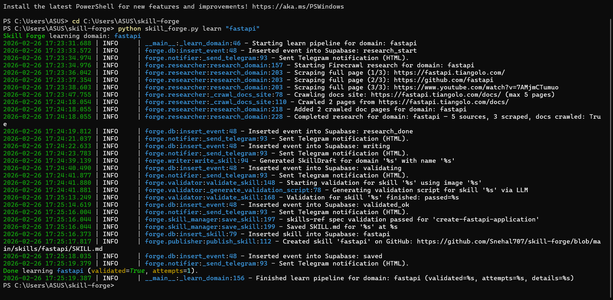
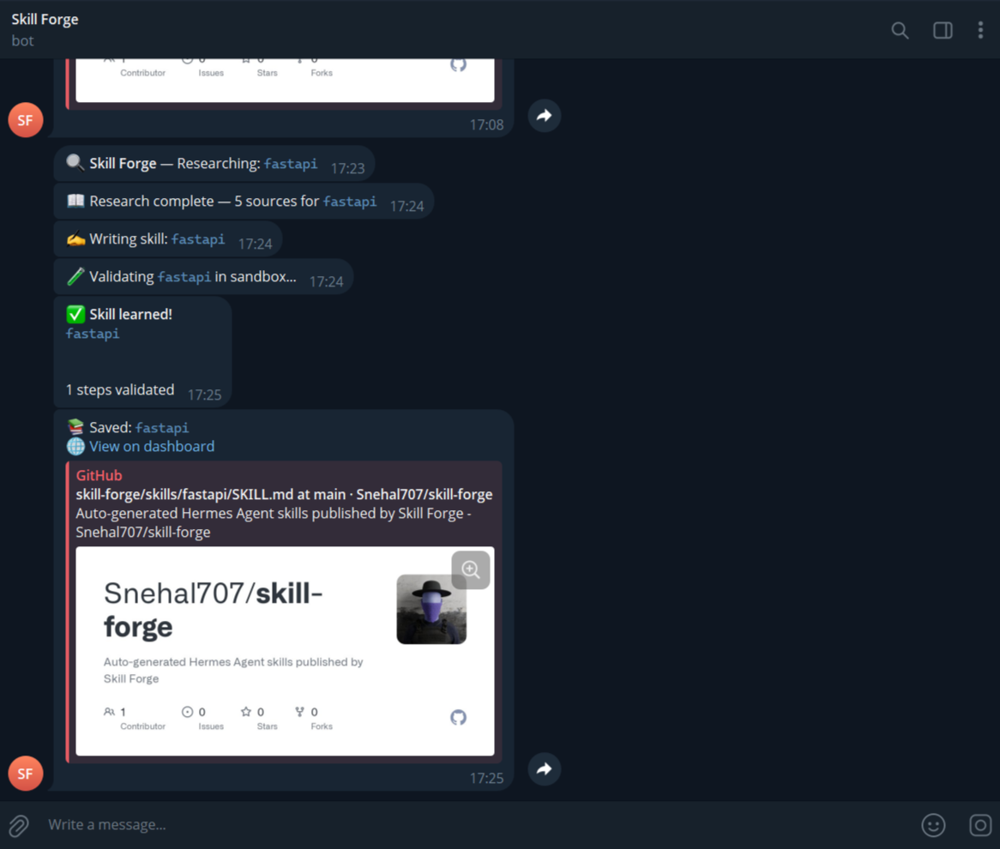
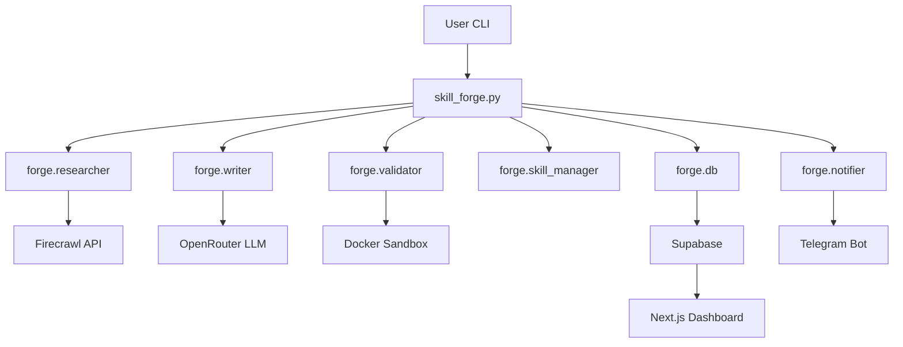

<p align="center">
  
</p>

<h1 align="center">Skill Forge</h1>

<p align="center">
  <strong>An autonomous agent that teaches itself new skills</strong> — researches domains, writes SKILL.md documents, validates them in Docker, and saves to Hermes Agent.
</p>

<p align="center">
  <a href="https://github.com/Snehal707/skill-forge-agent"></a>
  <a href="https://github.com/Snehal707/skill-forge-agent/blob/master/LICENSE"></a>
  <a href="https://github.com/NousResearch/hermes-agent"></a>
  <a href="https://agentskills.io"></a>
</p>

<p align="center">
  <a href="https://skill-forge-agent.vercel.app">Live Dashboard</a> •
  <a href="https://youtu.be/Hu9HJkuccVM">YouTube Demo</a> •
  <a href="https://github.com/Snehal707/skill-forge-agent">GitHub</a> •
  <a href="https://agentskills.io">agentskills.io</a>
</p>

---

## Watch the Demo

[](https://youtu.be/Hu9HJkuccVM)

---

## Screenshots

| Terminal | Telegram |
|:--------:|:--------:|
| [](assets/terminal.png) | [](assets/telegram.png) |
| CLI learning pipeline | Live notifications |

---

## Architecture

High-level flow from CLI to dashboard:



---

## How It Works

1. **Research** — Firecrawl scrapes the web for authoritative sources on the domain (e.g. `docker`, `kubernetes`, `python`).
2. **Write** — An LLM (Claude via OpenRouter) synthesizes research into a `SKILL.md` with YAML frontmatter and step-by-step instructions.
3. **Validate** — The skill procedure runs in a Docker sandbox to verify it actually works (up to 3 attempts).
4. **Save** — Persists to `~/.hermes/skills/<name>/SKILL.md` so Hermes Agent can use it.
5. **Sync** — Pushes events and skills to Supabase and Telegram for live visibility.

---

## Results & Stats

| Metric | Description |
|--------|-------------|
| **Domains** | 15+ domains (docker, kubernetes, git, python, postgresql, redis, nginx, linux, terraform, react, fastapi, mongodb, aws, github-actions, typescript, celery) |
| **Validation** | Skills are tested in Docker before saving |
| **Output** | `SKILL.md` files compliant with [agentskills.io](https://agentskills.io) |
| **Live** | Dashboard + Telegram updates in real time |

---

## Built for Hermes Agent

Skill Forge is designed to extend [Hermes Agent](https://github.com/NousResearch/hermes-agent) by populating its skills library. Every skill follows the [agentskills.io](https://agentskills.io) specification for SKILL.md format, ensuring compatibility with Hermes and any agentskills-compatible system.

---

## Prerequisites

- **Python 3.11+** with `pip`
- **Node.js 18+** and `npm` (for dashboard)
- **Docker** installed and on `PATH` (for validation sandbox)
- **Supabase** project (URL + service key + anon key)
- **OpenRouter** API key
- **Firecrawl** API key
- **Telegram** bot token and chat ID

---

## Installation

```bash
git clone https://github.com/Snehal707/skill-forge-agent.git
cd skill-forge-agent
python -m venv .venv
.venv\Scripts\activate   # Windows
# source .venv/bin/activate   # macOS/Linux
pip install -r requirements.txt
```

Copy `.env.example` to `.env` and configure:

| Variable | Description |
|----------|-------------|
| `OPENROUTER_API_KEY` | OpenRouter API key |
| `FIRECRAWL_API_KEY` | Firecrawl API key |
| `TELEGRAM_BOT_TOKEN` | Telegram bot token |
| `TELEGRAM_CHAT_ID` | Your Telegram chat ID |
| `SUPABASE_URL` | Supabase project URL |
| `SUPABASE_SERVICE_KEY` | Supabase service role key |
| `SKILLS_DIR` | Hermes skills path (e.g. `~/.hermes/skills`) |
| `DASHBOARD_URL` | Live dashboard URL |

Verify setup:

```bash
python -m forge.health_check
```

---

## Quick Start

```bash
# Learn a single domain
python skill_forge.py learn docker

# Learn all configured domains
python skill_forge.py learn-all

# View stats
python skill_forge.py status

# Daily summary to Telegram
python skill_forge.py summary
```

---

## Tech Stack

| Layer | Technologies |
|-------|--------------|
| **Agent** | Python 3.11, OpenRouter (Claude), Firecrawl, Supabase, python-telegram-bot |
| **Validation** | Docker sandbox |
| **Dashboard** | Next.js 14, TypeScript, Tailwind CSS, Supabase Realtime |
| **Deploy** | Vercel |

---

## Project Structure

```
skill-forge-agent/
├── forge/                    # Python agent package
│   ├── researcher.py         # Firecrawl web research
│   ├── writer.py             # LLM SKILL.md generator
│   ├── validator.py          # Docker sandbox validation
│   ├── skill_manager.py      # Hermes skills directory I/O
│   ├── notifier.py           # Telegram notifications
│   ├── db.py                 # Supabase client
│   ├── llm.py                # OpenRouter LLM helper
│   ├── summarizer.py         # Daily summary builder
│   └── health_check.py       # Environment checks
├── skill_forge.py            # CLI entry point
├── config/forge_config.yaml  # Configuration
├── prompts/                  # LLM prompt templates
├── dashboard/                # Next.js dashboard (Vercel)
│   ├── app/
│   ├── components/
│   └── lib/
├── scripts/                  # Sync & prune utilities
└── assets/                   # Screenshots
```

---

## Dashboard

**Live:** [skill-forge-agent.vercel.app](https://skill-forge-agent.vercel.app)

- **StatsBar** — Total skills, skills today, validation success rate, domains covered
- **LiveFeed** — Real-time event stream via Supabase subscriptions
- **SkillCards** — Domain/category tags, validation badges
- **SkillModal** — Full SKILL.md with syntax highlighting and copy button

### Local Development

```bash
cd dashboard
npm install
npm run dev
```

Open [http://localhost:3000](http://localhost:3000).

---

## Telegram Setup

1. Create a bot with [@BotFather](https://t.me/BotFather)
2. Add `TELEGRAM_BOT_TOKEN` and `TELEGRAM_CHAT_ID` to `.env`
3. Test: `python -m forge.notifier`

---

## Supabase Setup

1. Create a project at [supabase.com](https://supabase.com)
2. Run the schema from `AGENTS.md` (skills + events tables, enable realtime)
3. Add `SUPABASE_URL`, `SUPABASE_SERVICE_KEY` to `.env`
4. Add `NEXT_PUBLIC_SUPABASE_URL`, `NEXT_PUBLIC_SUPABASE_ANON_KEY` to Vercel env

---

## Links

| Resource | URL |
|----------|-----|
| **Live Dashboard** | [skill-forge-agent.vercel.app](https://skill-forge-agent.vercel.app) |
| **YouTube Demo** | [youtu.be/Hu9HJkuccVM](https://youtu.be/Hu9HJkuccVM) |
| **GitHub** | [github.com/Snehal707/skill-forge-agent](https://github.com/Snehal707/skill-forge-agent) |
| **Hermes Agent** | [github.com/NousResearch/hermes-agent](https://github.com/NousResearch/hermes-agent) |
| **SKILL.md Spec** | [agentskills.io](https://agentskills.io) |

---

For full specification and design details, see [AGENTS.md](AGENTS.md).
