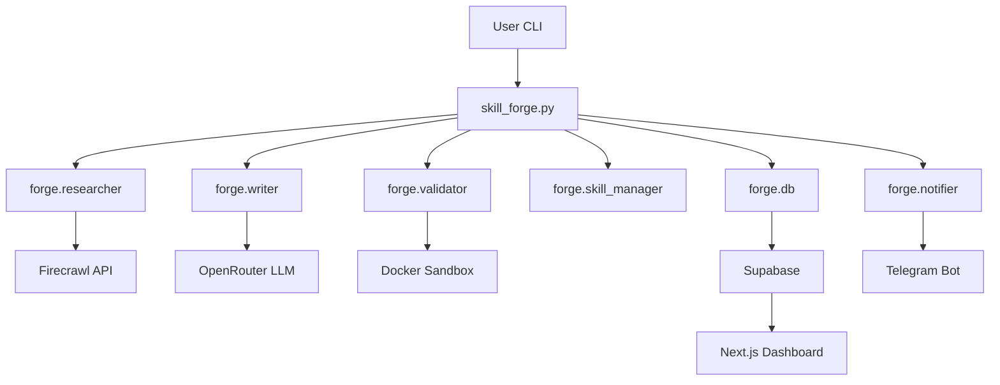

## Skill Forge

Skill Forge is an autonomous agent built on top of Hermes Agent that
teaches itself new skills by researching a domain, writing a SKILL.md
document, validating it in a Docker sandbox, and saving it to the Hermes
skills library. Every key event is pushed to Supabase (for a live Vercel
dashboard) and mirrored to Telegram.

---

### Architecture Overview

High-level flow from CLI to dashboard:



---

### Project Layout

- `forge/` — Python package for the autonomous agent:
  - `researcher.py` — Firecrawl-powered web research.
  - `writer.py` — LLM-based SKILL.md generator.
  - `validator.py` — Docker sandbox validation.
  - `notifier.py` — Telegram notifications.
  - `skill_manager.py` — reads/writes to the Hermes skills dir.
  - `summarizer.py` — daily summary builder.
  - `health_check.py` — environment and dependency health checks.
  - `llm.py` — OpenRouter-backed LLM helper.
  - `db.py` — Supabase client and queries.
- `skill_forge.py` — main CLI (learn, learn-all, status, summary).
- `config/forge_config.yaml` — non-secret configuration.
- `prompts/` — prompt templates for internal agents.
- `dashboard/` — Next.js 14 + TypeScript + Tailwind + Supabase realtime.

See `AGENTS.md` for the full specification and design details.

---

### Prerequisites

- Python 3.11+ with `pip`.
- Node.js 18+ and `npm`.
- Docker installed and on `PATH` (for validation sandbox).
- Supabase project (URL + service key + anon key).
- OpenRouter API key.
- Firecrawl API key.
- Telegram bot token and chat ID.

---

### Installation (Agent)

```bash
git clone <this-repo>
cd skill-forge
python -m venv .venv
.venv\Scripts\activate  # Windows
pip install -r requirements.txt
```

Copy `.env.example` to `.env` and fill in:

- `OPENROUTER_API_KEY`
- `FIRECRAWL_API_KEY`
- `TELEGRAM_BOT_TOKEN`
- `TELEGRAM_CHAT_ID`
- `SUPABASE_URL`
- `SUPABASE_SERVICE_KEY`
- `SKILLS_DIR` (e.g. `C:\Users\ASUS\.hermes\skills`)
- `DASHBOARD_URL` (your Vercel dashboard URL)

You can verify everything with:

```bash
python -m forge.health_check
```

---

### Telegram Setup

1. In Telegram, start a chat with `@BotFather`.
2. Run `/newbot` and follow the prompts to create **Skill Forge** bot.
3. Copy the bot token into `TELEGRAM_BOT_TOKEN` in `.env`.
4. Start a chat with your bot so it can send messages.
5. Get your numeric `TELEGRAM_CHAT_ID` (for example via a simple helper bot or API)
   and set `TELEGRAM_CHAT_ID` in `.env`.
6. Run a quick notifier test:

```bash
python -m forge.notifier
```

You should see a “Researching: notifier-test” message in your chat.

---

### Supabase Setup

1. Create a new project at `supabase.com`.
2. In the SQL editor, create the `skills` and `events` tables and enable realtime
   as described in `AGENTS.md`.
3. In Supabase **Settings → API**, copy:
   - `URL` → `SUPABASE_URL` and `NEXT_PUBLIC_SUPABASE_URL`
   - `service_role key` → `SUPABASE_SERVICE_KEY`
   - `anon key` → `NEXT_PUBLIC_SUPABASE_ANON_KEY`
4. Add these values to `.env` (Python agent) and to the Vercel dashboard env.

---

### Running the Agent

Activate your virtualenv and run:

```bash
python skill_forge.py learn docker
```

This will:

- Research the domain via Firecrawl.
- Write a SKILL.md via the LLM.
- Attempt validation in a Docker sandbox.
- Save the skill into the Hermes skills directory.
- Insert events and skills into Supabase.
- Send Telegram notifications for each stage.

Other commands:

- `python skill_forge.py learn-all` — run the pipeline for all domains configured
  under `domains:` in `config/forge_config.yaml`.
- `python skill_forge.py status` — show aggregate Supabase stats.
- `python skill_forge.py summary` — send a one-off daily summary to Telegram.
- `python skill_forge.py summary --daemon` — run the daily summary on a schedule
  using the `schedule` library.

---

### Dashboard (Local Dev)

From the `dashboard/` directory:

```bash
cd dashboard
npm install
npm run dev
```

This starts the Next.js app at `http://localhost:3000` with:

- **StatsBar** — total skills, skills today, validation success rate, domains covered.
- **LiveFeed** — realtime `events` stream via Supabase subscriptions.
- **SkillGrid** — cards for skills with domain/category tags and validation badges.
- **SkillModal** — slide-in panel showing full SKILL.md with syntax highlighting.

---

### Dashboard (Vercel Deploy)

1. Ensure `dashboard/vercel.json` is committed (it configures `npm run build`).
2. Push the repository to GitHub (or your preferred Git provider).
3. In Vercel:
   - Click **New Project → Import** and select this repo.
   - If needed, set **Root Directory** to `dashboard/`.
   - Build command: `npm run build`
   - Output directory: `.next`
4. Add the following environment variables in the Vercel project:
   - `NEXT_PUBLIC_SUPABASE_URL`
   - `NEXT_PUBLIC_SUPABASE_ANON_KEY`
5. Deploy the project. After deployment:
   - Copy the Vercel URL and set it as `DASHBOARD_URL` in your agent `.env`.
   - Trigger a learn run (e.g. `python skill_forge.py learn docker`) and verify
     that new events/skills appear live on the dashboard.


